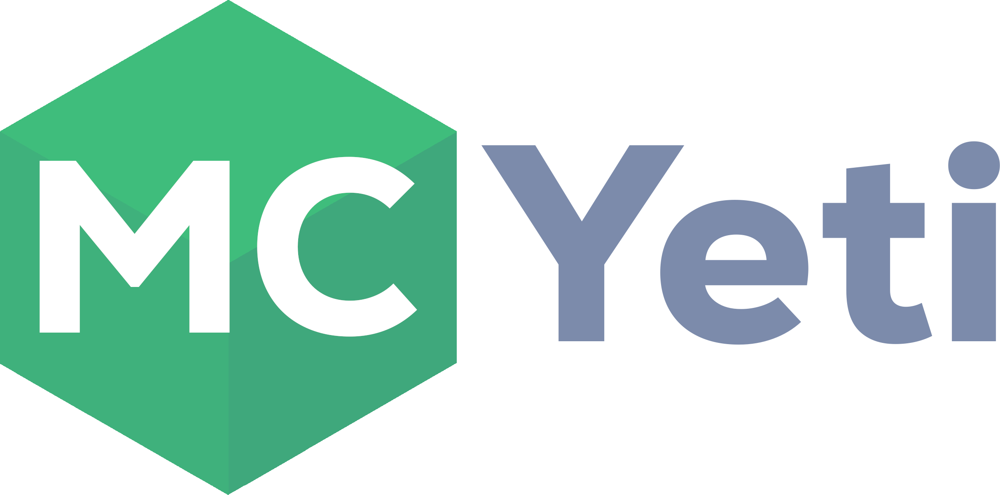

<p align="center"></p>
<p align="center">Minecraft Classic server software</p>

## Build
```
dub build
```

## Set up guide
1. build the server with `dub build` it will make a server executable in the root directory called `mcyeti`
2. run the server and then immediately kill it (with Control C for example)
3. edit properties/server.json and set the owner value to your username
4. port forward if required
5. run the server again

### Extra info
- use /help to see commands
- for converting ClassicWorld (.cw) levels to .ylv, please use [this](https://github.com/minecraft8997/CW2YLV)
